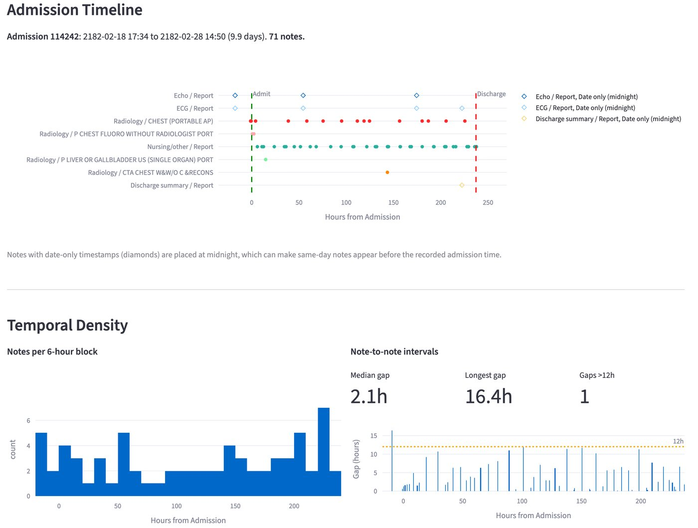
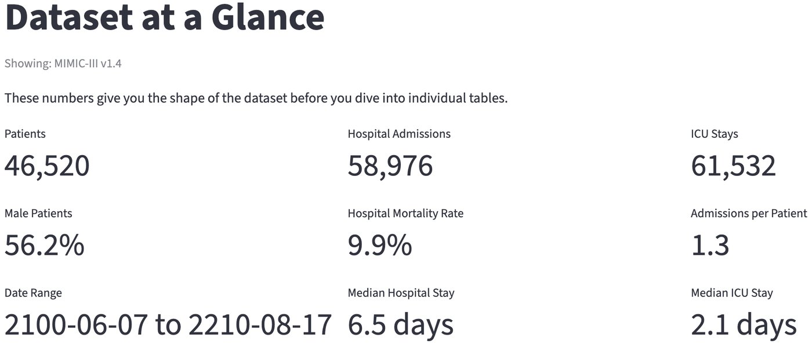
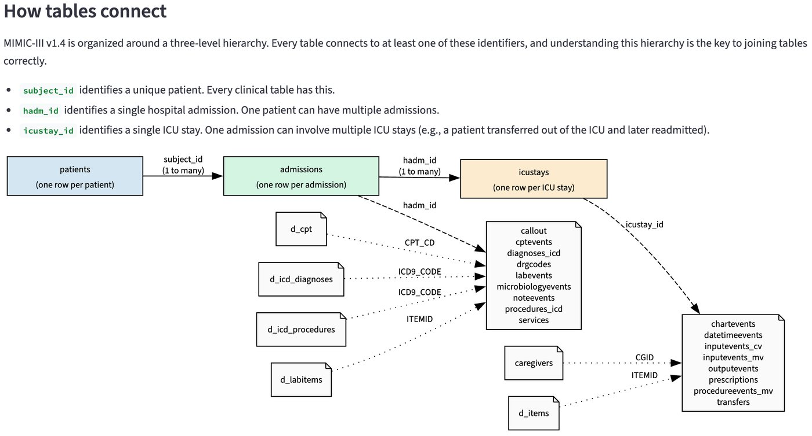

# MIMIC Explorer

Interactive Streamlit app for exploring MIMIC-III and MIMIC-IV clinical datasets. Reads CSV.gz files directly with DuckDB -- no ETL, no database setup.



## Getting started

You need local copies of the MIMIC CSV.gz files (downloaded from PhysioNet after credentialing).

Install dependencies and run:

```bash
uv sync --all-groups
uv run streamlit run app.py
```

By default the app looks for datasets at:

- MIMIC-III: `~/projects/mimic-iii/physionet.org/files/mimiciii/1.4`
- MIMIC-IV: `~/projects/mimic-iv/physionet.org/files/mimiciv/3.1`
- MIMIC-IV-Note: `~/projects/mimic-iv-note/physionet.org/files/mimic-iv-note/2.2/note`

MIMIC-IV-Note is a separate PhysioNet module containing clinical notes for MIMIC-IV (discharge summaries and radiology reports). Download it from [PhysioNet](https://physionet.org/content/mimic-iv-note/) after credentialing. The note timeline page uses this module when working with MIMIC-IV.

To use different paths, set environment variables before launching:

```bash
export MIMIC_III_PATH=/your/path/to/mimiciii/1.4
export MIMIC_IV_PATH=/your/path/to/mimiciv/3.1
export MIMIC_IV_NOTE_PATH=/your/path/to/mimic-iv-note/2.2/note
uv run streamlit run app.py
```

Switch between MIMIC-III and MIMIC-IV at any time using the dataset selector in the sidebar.

## What each page does

**Dataset at a Glance** gives you the key numbers: patient count, admissions, ICU stays, mortality rate, and median length of stay. Each metric includes a plain-language explanation of what it means clinically. Start here to get oriented.

<details>
<summary>Screenshot</summary>


</details>

**Database Schema** shows how tables relate to each other through the `subject_id` / `hadm_id` / `icustay_id` join key hierarchy. Tables are grouped by connectivity, each expandable to show column details. Ready-to-use join patterns are included so you can start writing queries against the tables you care about.

<details>
<summary>Screenshot</summary>


</details>

**Clinical Insights** shows distributions across the dataset: top diagnoses, procedures, and lab tests; patient demographics (age, gender, ethnicity); and length-of-stay patterns. Useful for understanding the patient population before designing cohort filters.

**Temporal Note Timeline** explores clinical notes across hospital stays (uses NOTEEVENTS for MIMIC-III, or the separate MIMIC-IV-Note module for MIMIC-IV). It shows a category overview of note types, a per-admission timeline of when notes were written, temporal density patterns, note-to-note interval distributions, and a note text viewer. This page is most relevant for researchers working with clinical text.

**Community References** collects links to official documentation, tutorial notebooks, the mimic-code repository, and other community resources.

## How this relates to existing MIMIC resources

The MIMIC ecosystem already has good resources, but they serve different purposes.

**Official documentation** at [mimic.mit.edu](https://mimic.mit.edu/docs/iv/) provides thorough column-level descriptions for each table. It's the authoritative reference, but it's organized as individual pages per table with no cross-table navigation, no visual schema map, and no dataset-level summary statistics. You learn what a column means, but not how the dataset fits together.

**mimic-code** ([github.com/MIT-LCP/mimic-code](https://github.com/MIT-LCP/mimic-code)) is the official community repository with PostgreSQL/BigQuery build scripts, derived concept SQL, and tutorial notebooks. It's aimed at researchers who already have a working mental model of the data and need to compute specific clinical concepts.

**BigQuery on GCP** lets credentialed researchers query MIMIC-IV directly in the browser. It functions as a de facto data browser, but requires GCP access and doesn't provide orientation or relationship context.

**Tutorials** exist (Alistair Johnson's [data tutorial](https://alistairewj.github.io/talk/2020-mimic-iv-data-tutorial/) and [analysis tutorial](https://alistairewj.github.io/talk/2020-mimic-iv-analysis-tutorial/), a [Colab notebook](https://colab.research.google.com/drive/1REu-ofzNzqsTT1cxLHIegPB0nGmwKaM0), and [workshop materials](https://github.com/MIT-LCP/mimic-workshop)) but they're scattered and assume some familiarity with the dataset structure.

**SchemaSpy** ([lcp.mit.edu/mimic-schema-spy](https://lcp.mit.edu/mimic-schema-spy/)) is the closest thing to an interactive schema explorer. Generated from a PostgreSQL load of MIMIC-III, it provides clickable table views, foreign key diagrams, column-level metadata, and relationship navigation. It's thorough for schema structure, but covers MIMIC-III only (generated in 2017), requires a Postgres load to regenerate, shows metadata without actual data browsing, and doesn't provide dataset-level clinical context. A [GitHub issue](https://github.com/MIT-LCP/mimic-code/issues/183) also collected community-contributed ER diagrams, and the MIMIC-IV [Scientific Data paper](https://www.nature.com/articles/s41597-022-01899-x) includes schema figures.

**What this tool adds**: dataset-level orientation (key statistics with clinical context), interactive exploration of CSV.gz files with no database setup, and support for both MIMIC-III and MIMIC-IV. It's the "guided tour" layer that sits between the official docs (reference) and mimic-code (analysis). For schema relationships specifically, SchemaSpy's FK diagrams are more detailed than what we show -- our join key matrix is a simpler view focused on the three core identifiers that matter most for getting started.
